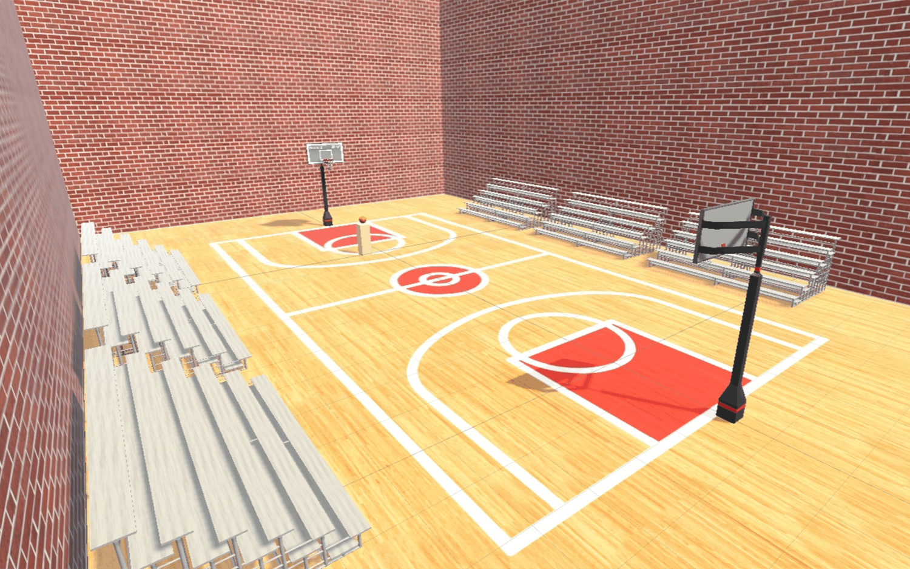

# Shooting Hoops VR

**Copyright &copy; 2021 Kyler Tran**

Shooting Hoops VR is an immersive virtual reality basketball game that lets players experience the thrill of shooting basketballs without needing a ball. Developed using the Unity XR library, this game offers realistic basketball mechanics and environments tailored for VR enthusiasts.

## Game Overview

Practice your shooting skills in a fully interactive basketball environment with functional hoop physics and advanced score detection. Shooting Hoops VR provides a compelling and challenging experience. Whether you're a casual player or an athelete, this game offers something for everyone.

## Features

- **Realistic Basketball Court**: Experience a lifelike basketball court with immersive sound and particle effects.
- **Functional Hoops**: Every basket is equipped with score detection to keep track of your shooting accuracy.
- **Infinite Ball Respawn**: Never run out of basketballs; they respawn infinitely, allowing for continuous play.
- **60-Second Shooting Mode**: Challenge yourself with a timed mode where you can test how many points you can score in 60 seconds.

## System Requirements

- Compatible with all PCVR-compatible headsets.
- Requires a VR-ready PC with at least 8GB of RAM, a dedicated graphics card, and a modern processor.

## Contact

**Kyler Tran**  
Email: [contact@kylertran.com](mailto:contact@kylertran.com)
